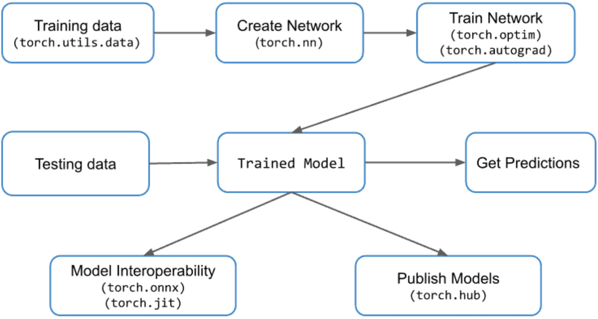

---
---
# nlp-news-categorization
Assignment Option Four - News Categorization using PyTorch

Link to our GitHub repository: https://github.com/lennartmoritz/nlp-news-categorization
---
---
# Authors
 * Carlotta Mahncke 
 * Lennart Joshua Moritz
 * Timon Engelke 
 * Christian Schuler
 
--- 
---
# Setup
 * `sudo apt install python3-venv`
 * `python3 -m venv venv`
 * `source venv/bin/activate`
 * Automatic: ./script-caller.bh`
 * Or Manual:
   * `pip install -r requirements.txt`
   * `python -m spacy download "en_core_web_sm"`
 
---
---
# Use
### Multiclass
 * `python news-categorization.py -l b t e m`
### Binary classification
 * `python news-categorization.py -l b t`
### Specify embedding
 * `python news-categorization.py -l b t -e word2vec`
 * Choose from: word, lemma, word2vec, glove

---
---
# Task
Text categorization using PyTorch

 * A typical workflow in PyTorch. 

---
---
# Dataset 

News Aggregator Dataset
https://www.kaggle.com/datasets/uciml/news-aggregator-dataset

